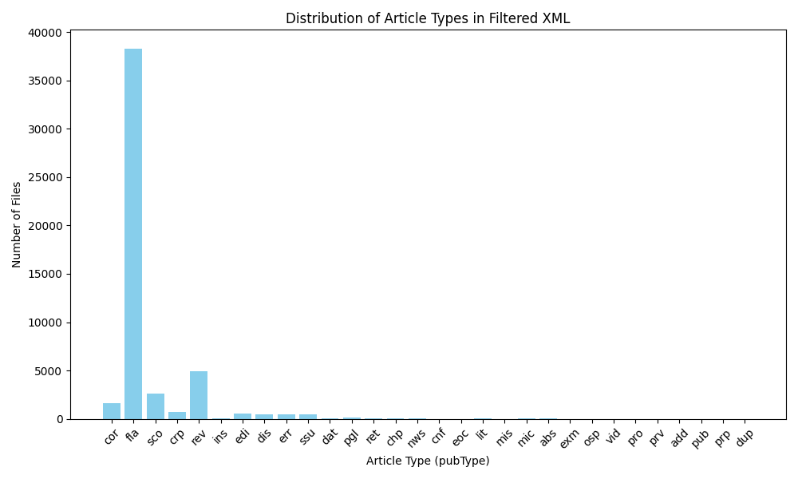

# 🌿 Belladonna

**A research pipeline that turns breast-cancer literature into a structured, searchable knowledge base — and a tiered benchmark for evaluating LLMs on it.**

Belladonna pulls breast-cancer knowledge from clinical guidelines, drug labels, trial registries and the primary literature, distills each source into atomic **factoids** (self-contained, verifiable statements with provenance), embeds them into a vector database, and serves them through retrieval-augmented generation (RAG).

[](LICENSE)


---

## What's a "factoid"?

A **factoid** is the atomic unit of this project: one structured scientific claim, extracted from source text by an LLM, carrying its metadata and licence/provenance so it can be traced back to the original document. Every data source flows through the same funnel to produce them:

```
  fetch  ──►  filter  ──►  process  ──►  extract factoids  ──►  embed  ──►  vector DB
 (source)   (relevance)  (clean text)   (LLM → JSON)         (vectors)  (Chroma / Qdrant)
                                                                              │
                                                                              ▼
                                                              query_embedding ─► rag_factoids
                                                                          (retrieval-augmented answers)
```

---

## Data sources

Each source has its own subfolder under [`scripts/`](scripts) implementing that funnel end to end.

| Source | What it covers | Folder |
|--------|----------------|--------|
| **EPMC** | Europe PMC open-access full-text literature | [`scripts/EPMC/`](scripts/EPMC) |
| **Elsevier** | Elsevier / ScienceDirect papers (licensed access) | [`scripts/Elsevier/`](scripts/Elsevier) |
| **CTG** | ClinicalTrials.gov trial records | [`scripts/CTG/`](scripts/CTG) |
| **FDA** | FDA drug labels & approvals | [`scripts/FDA/`](scripts/FDA) |
| **EMA** | European Medicines Agency documents | [`scripts/EMA/`](scripts/EMA) |
| **ASCO** | ASCO clinical practice guidelines (PDF) | [`scripts/`](scripts) · [`ASCO/`](ASCO) |
| **ESMO** | ESMO guideline & meeting content | [`scripts/ESMO/`](scripts/ESMO) |
| **AGO** | AGO breast-cancer recommendations | [`scripts/AGO/`](scripts/AGO) |
| **PubMed** | PubMed abstracts & metadata (NCBI) | [`scripts/`](scripts) |

---

## Quick start

```bash
# 1) create and activate the environment
conda env create -f environment.yml
conda activate belladonna

# 2) (optional) install the package in editable mode
pip install -e .
```

Then run a stage of the pipeline. For example, fetch literature from Europe PMC:

```bash
python scripts/EPMC/download_EPMC.py \
    --query "breast cancer endocrine therapy" \
    --limit 500 \
    --outdir artifacts/epmc

# ...extract, embed, then ask a question over the knowledge base:
python scripts/rag_factoids.py --query "First-line therapy for HR+/HER2- metastatic breast cancer?"
```

> Configuration lives in [`configs/default.yaml`](configs/default.yaml). Secrets (API keys, emails) are read from the environment / a `.env` file — never commit them.

---

## Repository layout

```
belladonna/
├── scripts/              # the pipeline, grouped by data source
│   ├── EPMC/  Elsevier/  CTG/  FDA/  EMA/  ESMO/  AGO/   # per-source: fetch → filter → process → factoids → embed
│   ├── create_factoid.py         # core LLM factoid extraction
│   ├── factoids_utils.py         # shared parsing / validation helpers
│   ├── dedupe_factoids.py        # semantic de-duplication
│   ├── embed_factoids.py         # embed factoids into the vector DB
│   ├── qdrant_ingest.py          # ingest into Qdrant
│   ├── query_embedding.py        # embed a user query for retrieval
│   ├── rag_factoids.py           # RAG over the factoid store
│   ├── NER.py                    # named-entity recognition
│   └── dashboard.py / visualization*.py   # analysis & figures
├── src/belladonna/       # installable package
├── configs/              # YAML configuration
├── ASCO/                 # source guideline PDFs
├── environment.yml       # conda environment
└── pyproject.toml        # build / lint / type-check config
```

### Pipeline scripts, by stage

| Stage | Scripts (examples) |
|-------|--------------------|
| **Fetch** | `EPMC/download_EPMC.py`, `Elsevier/fetch_elsevier.py`, `CTG/fetch_ctg.py`, `FDA/fetch_fda.py`, `EMA/download_ema.py`, `download_pubmed.py` |
| **Filter** | `EPMC/filtering_EPMC.py`, `CTG/filtering_CTG.py`, `FDA/fda_filtering.py`, `EMA/filtering_ema.py`, `filtering_elsevier.py` |
| **Process** | `data_processing.py`, `data_processing_epmc.py`, `data_processing_elsevier.py`, `processASCO.py`, `AGO/processAGO.py`, `ESMO/processESMO.py` |
| **Extract factoids** | `create_factoid.py`, `factoids_ASCO.py`, `factoids_epmc.py`, `*/factoids_*.py` |
| **Embed & ingest** | `embed_factoids.py`, `*/*_embedding.py`, `qdrant_ingest.py` |
| **Retrieve / RAG** | `query_embedding.py`, `rag_factoids.py`, `test_rag.py` |
| **Licence & provenance** | `add_licenseinfo.py`, `add_source_hierarchy.py`, `EPMC/license_epmc.py`, `Elsevier/license_elsevier.py` |
| **Analysis** | `dashboard.py`, `visualization.py`, `generate_conference_visualizations.py`, `NER.py` |

---

## Data & artifacts

All fetched documents, extracted factoids and vector stores are written to `artifacts/` and are **git-ignored** — the repository holds code, not data. Point scripts at your own `--outdir` / `data_dir` to reproduce the corpus locally.



---

## Development

```bash
ruff check .        # lint
black .             # format (line length 100)
mypy src            # type-check (strict)
pytest              # tests
```

## License

Released under the [MIT License](LICENSE). Source documents retain their original licences; see the per-source licence scripts and `add_licenseinfo.py` for how provenance is tracked.
